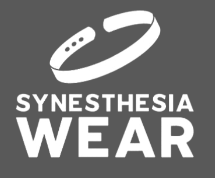
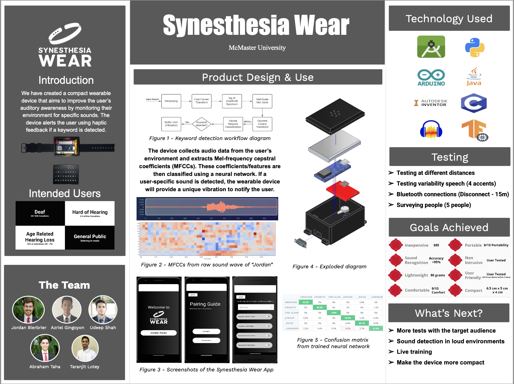

# Synesthesia Wear

  

> Feel the Sound: A wearable device to detect environmental sounds and provide sensory feedback.

---

## 📖 Project Overview

**Synesthesia Wear** is a wearable device that improves users’ awareness of sounds within their environment.  
The system consists of three main components:

- **Bracelet:** A compact, wrist-worn device with built-in audio, Bluetooth, and vibration motor for customizable haptic feedback.
- **Android App:** An interactive mobile application where users can:
  - Assign haptic patterns to specific keywords or sounds
  - Customize vibration settings
  - Enable or disable sounds dynamically
- **Sound Processing Module:** A machine learning system trained with the Edge Impulse platform that:
  - Extracts **MFCC (Mel-Frequency Cepstral Coefficient)** features from environmental audio.
  - Uses a lightweight **1D Convolutional Neural Network (1D-CNN)** to classify specific sounds (e.g., fire alarms, names).
  - Optimized for real-time performance and low power consumption on wearable devices.

A **working prototype** successfully detected fire alarms and recognized several names in real-world environments.

---

## 📸 Project Media
> _[Watch the Demo Video](docs/UserGuide/UserGuideVideo.mov)_

<!-- > -->

> 

---

## ✨ Features
- Real-time sound detection and classification
- Vibration feedback alerts for key sounds
- Lightweight and portable device design
- Easily extendable to new sound classes

---

## 🗂 Repository Structure

| Folder           | Purpose                                                   |
|-----------------------|-----------------------------------------------------------|
| `docs/`               | Documentation, design decisions, system architecture, presentation     |
| `src/`                | Firmware source code, machine learning model, mobile application          |

---

## 👨‍💻 Developers
- Jordan Bierbrier
- Abraham Taha
- Udeep Shah
- Azriel Gingoyon
- Taranjit Lotey

## 📈 Future Improvements
- Further miniaturization of the bracelet hardware for enhanced wrist comfort
- Integration of a higher-quality microphone to improve sound recognition accuracy

---

Thank you for checking out Synesthesia Wear! 🎉
